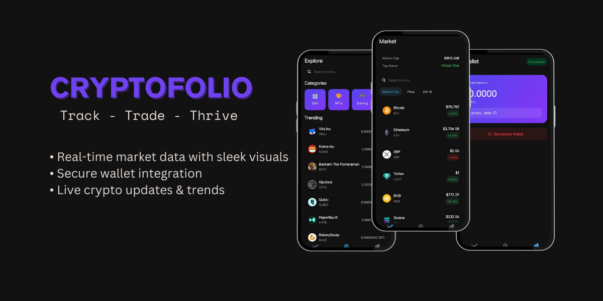
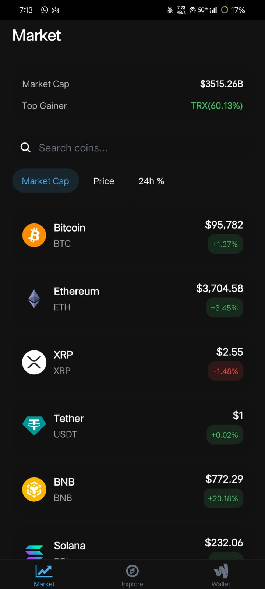
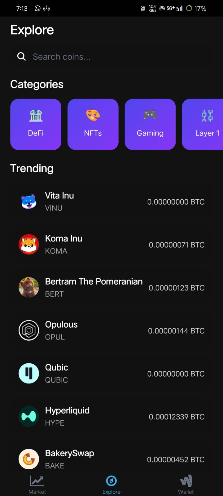
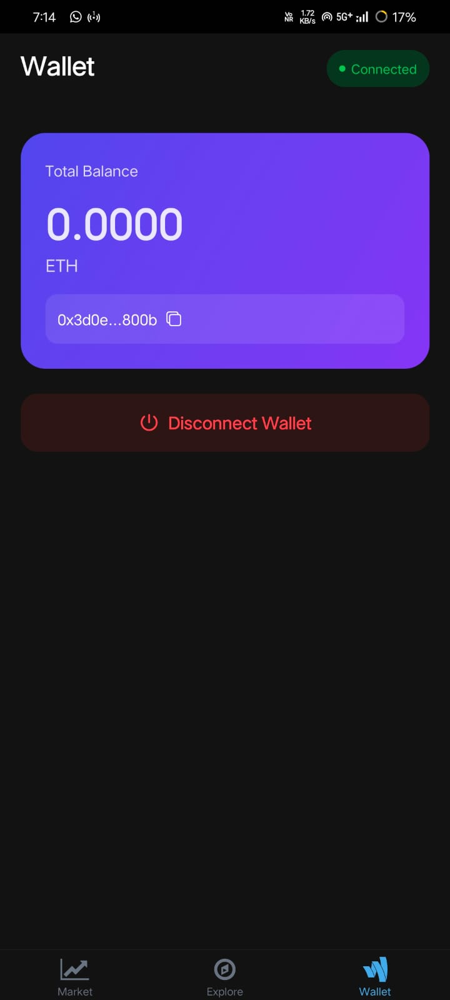

# CryptoFolio (Under Development)

A sleek and modern cryptocurrency tracking application built with React Native and Expo, offering real-time market data, wallet connectivity, and an intuitive user interface.



## ✨ Key Features

### Market Screen
- **Enhanced Market Overview**: Track cryptocurrency prices with beautifully designed cards
- **Advanced Sorting**: Sort by Market Cap, Price, or 24h Price Change
- **Smart Search**: Instantly find cryptocurrencies with real-time search
- **Market Statistics**: View total market cap and top gainers/losers
- **Pull to Refresh**: Get the latest data with a simple pull gesture
- **Smooth Animations**: Elegant loading states and transitions

### Explore Screen
- **Trending Coins**: Discover popular cryptocurrencies
- **Category Navigation**: Browse coins by categories (DeFi, NFTs, Gaming, Layer 1)
- **Latest Updates**: Real-time cryptocurrency news and updates from CoinGecko
- **Interactive UI**: Responsive cards and smooth scrolling experience

### Wallet Screen
- **WalletConnect Integration**: Seamless wallet connection with major providers
- **Balance Display**: View your ETH balance in real-time
- **Secure Connection**: Safe and reliable wallet connectivity
- **Visual Feedback**: Clear connection status and balance updates

### Shared Features
- **Dark/Light Theme**: Automatic theme switching based on system preferences
- **Native Feel**: Platform-specific UI components and animations
- **Error Handling**: Graceful error states and user feedback
- **Type Safety**: Full TypeScript implementation for reliability

## 🛠️ Technology Stack

- **Frontend Framework**: React Native + Expo
- **State Management**: React Query for data fetching
- **Wallet Integration**: WalletConnect v2
- **API Integration**: CoinGecko API
- **Animations**: Moti + Reanimated
- **Navigation**: Expo Router
- **Styling**: Native StyleSheet with theme support
- **Type Safety**: TypeScript
- **UI Components**: Custom themed components

## 📱 Screenshots

<div align="center">
  <div style="display: flex; justify-content: space-between; margin: 20px 0;">
    
    
    
  </div>
</div>

## 🚀 Getting Started

### Prerequisites

- Node.js >= 14
- npm or yarn
- Expo CLI
- iOS Simulator (Mac) or Android Emulator

### Quick Start

1. Clone the repository:
```bash
git clone [repo-url]
```

2. Install dependencies:
```bash
cd cryptofolio
npx expo install
```

3. Create environment variables:
```bash
# .env
EXPO_PUBLIC_WALLET_CONNECT_PROJECT_ID=your_project_id
```

4. Start development server:
```bash
npx expo start
```

## 📖 Usage Guide

### Market Screen
- View all cryptocurrencies with real-time prices
- Sort by different metrics
- Search for specific coins
- Pull to refresh for latest data

### Explore Screen
- Browse trending cryptocurrencies
- Navigate through different categories
- Stay updated with latest crypto news
- Interact with category cards

### Wallet Screen
- Connect your crypto wallet securely
- View your ETH balance
- Disconnect wallet when needed
- See connection status

## 🎯 Roadmap

- [ ] Portfolio tracking and management
- [ ] Price alerts and notifications
- [ ] Advanced charting options
- [ ] Multiple wallet support
- [ ] Custom watchlists
- [ ] Social features and sharing
- [ ] Price conversion tools
- [ ] Transaction history viewer

## 💡 Contributing

Contributions are welcome! Feel free to:
- Report bugs
- Suggest new features
- Submit pull requests

Please read our [Contributing Guidelines](CONTRIBUTING.md) before submitting PRs.

## 📄 License

This project is licensed under the MIT License - see [LICENSE](LICENSE) for details.

## 🙏 Acknowledgments

- CoinGecko for their comprehensive crypto API
- WalletConnect for wallet integration capabilities
- Expo team for their excellent development platform
- React Native community for continuous support
